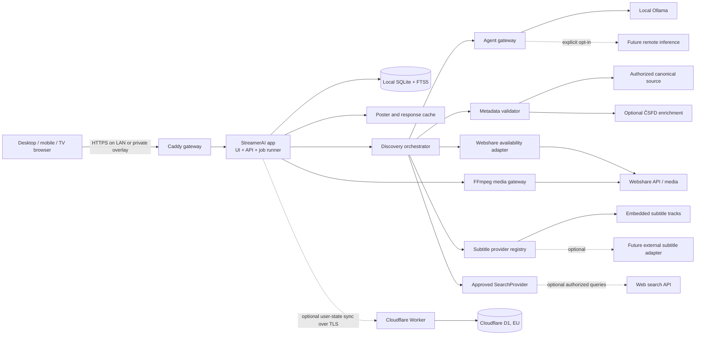

# StreamerAI deployment architecture

> **Status:** ACTIVE DIRECTION — revised by owner for on-demand discovery on 2026-09-27
> **Scope:** home self-hosted MVP, up to 5 profiles, thousands of titles, one concurrent stream
> **Last research check:** 2026-09-27

This document defines the target deployment architecture. The revised product
flow is specified in `DISCOVERY.md`; implementation created before that
revision must be reviewed against it before reuse.

## 1. Architecture decisions

1. Run the product as a **local-first home node**. Browsers and future TV/mobile clients connect to one always-on desktop or home server.
2. Ship the UI as a PWA, but run discovery sessions, provider access, scraping, background jobs, media handling, and AI orchestration in the home node — never in the browser.
3. Keep the complete local state in **SQLite in WAL mode**. The film database is a sparse, provenance-aware on-demand store, not a full upstream mirror. At this scale PostgreSQL, Redis, and Kubernetes would add operational cost without a useful benefit.
4. Run local inference behind an internal, provider-neutral inference gateway. Use Ollama for the MVP; allow an OpenAI-compatible remote endpoint later without changing domain logic.
5. Integrate Webshare as a provider adapter. Obtain a just-in-time private video link, then serve it through the home server's FFmpeg media gateway to the integrated player. Do not assume transcoding is performed by Webshare.
6. Build the catalog incrementally from conversational discovery. Model and web-search results are candidate hints; only metadata-validated canonical records enter the local database and result ranking.
7. Propose TMDB as the canonical metadata source for the non-commercial MVP, with required attribution. Keep ČSFD as an optional, isolated enrichment connector. Do not use IMDb.
8. Do not automate Rotten Tomatoes scraping without written authorization: its current terms prohibit automated collection and scraping. Use TMDB or ČSFD ratings with explicit provenance. Web search may locate another authorized rating source, but a search-result snippet is never itself accepted as a rating; when no authorized rating exists, display `Not rated` instead of inventing one.
9. Keep playback and all secrets local. Optionally synchronize only small user state through Cloudflare Workers + D1, with the local database remaining the source of truth.
10. Stream discovery progress to the UI as bounded task events. Never expose chain-of-thought, raw scraped pages, credentials, or unvalidated candidate names.
11. Keep metadata, media, subtitle, search, agent and sync integrations behind
    capability-based registries. TMDB and Webshare are initial adapters, never
    hard-coded domain assumptions; follow `INTEGRATIONS.md`.
12. Do not expose the home node directly to the public internet. Use LAN access by default and a private overlay such as Tailscale for later remote access.

## 2. Target topology



### Trust boundaries

- The browser uses the StreamerAI origin for application APIs and in-app media. FFmpeg runs on the home server; the browser never receives the Webshare direct link, password, WST session token, model-management access, or Cloudflare administrative credentials.
- The app is the only component allowed to call provider APIs and the agent gateway.
- The model receives bounded task input and sanitized validated facts, not credentials, stream URLs, raw cookies, or unrestricted database access.
- Model memory and web-search snippets may propose candidates but are never a source of record. Unresolved candidates cannot reach the result UI or later ranking.
- Cloud sync receives no provider credentials, model prompts, media URLs, full catalog mirror, posters, or media files.
- Scraped text is untrusted input. It cannot directly invoke a tool or modify records without schema validation and policy checks.

## 3. Proposed implementation stack

| Area | Proposal | Reason |
|---|---|---|
| Repository | TypeScript monorepo with pnpm | One language across UI, adapters, sync client, and the actively maintained ČSFD library |
| UI | React + Vite PWA | Static, responsive client; simpler self-hosting than an SSR dependency |
| Local API | Fastify + Zod/JSON Schema | Low overhead, streaming support, explicit contracts |
| Local persistence | SQLite, WAL, migrations, FTS5 | Reliable single-node storage and search for thousands of titles |
| Background work | Durable SQLite job table with leases, retry, and idempotency | Avoids Redis; survives process restarts |
| Discovery updates | Server-Sent Events from durable task state | Progressive UI without requiring a second realtime service |
| Integration registry | Capability-based typed adapters | Additional databases, media services and subtitle sources do not change domain logic |
| Local inference | Ollama through the app-owned agent gateway | Easiest GPU-aware MVP runtime on Windows/Linux |
| Reverse proxy | Caddy | Single HTTPS origin, security headers, optional internal CA |
| Media gateway | FFmpeg remux or transcode to a same-origin fragmented MP4 stream | Handles downloaded containers and selected audio tracks in the web player |
| Cloud sync | Optional Cloudflare Worker + D1 | Free tier is ample for small user-state sync |
| Tests | Vitest, adapter contract tests, Playwright E2E, AI evaluation fixtures | External HTML/API and AI behavior require regression coverage |

The application should be packaged as one image with two runtime modes (`serve` and `jobs`) or, initially, one process containing both. A separate database or queue service is not needed for the MVP. If a future public deployment needs multiple app replicas, replace the repository and job adapters with PostgreSQL-backed implementations; do not stretch SQLite across hosts.

## 4. Local data layout

The application data volume contains:

```text
data/
  streamer-ai.db              # authoritative local state
  cache/http/                 # bounded provider response cache
  cache/posters/              # bounded image cache
  backups/                    # encrypted, rotated SQLite backups
```

Rules:

- SQLite is persistent storage, not merely a cache. The application must work when Cloudflare, ČSFD, search, or the model is offline.
- SQLite contains only titles encountered through discovery, explicit browsing, playback, or user lists. It must never imply that the local database is a complete film catalog.
- Use FTS5 and normalized aliases for catalog search. A separate search engine is unnecessary at this scale.
- Store source provenance, retrieval time, connector version, and expiry with every external metadata value.
- Persist structured discovery intent, validated canonical IDs, result groups and concise conversation summaries. Raw prompts remain local and are retained only according to an explicit history setting.
- Persist provider-independent Library membership, playback progress and
  append-only Watch History events per profile.
- Cache Webshare search results for 6–24 hours and negative results for a shorter period. Recheck file availability before playback.
- Never persist Webshare direct links. Create one for each playback session and discard it when the session ends.
- Back up SQLite using its online-backup mechanism, not by copying a live database and WAL files independently.
- Keep daily encrypted backups for 7 days and weekly backups for 8 weeks; verify restore in CI or a scheduled local check.

## 5. Metadata and discovery

### 5.1 Canonical catalog

The application needs a stable source for canonical IDs, localized titles, seasons, episodes, release dates, cast, and poster paths. Depending only on a scraper would make the catalog fragile.

Proposed order:

1. **TMDB adapter — canonical MVP source.** Its API is available for non-commercial use with attribution. A commercial future version must obtain the appropriate agreement.
2. **ČSFD adapter — optional Czech enrichment.** Use `node-csfd-api`, pinned to an exact version, behind our own narrow `MetadataProvider` interface. Do not expose its MCP server to the model.
3. **Rotten Tomatoes — disabled.** Current terms explicitly prohibit automated scraping/data collection. Activation requires documented permission; a manual user-entered score may be supported instead.
4. **IMDb — excluded** by product decision.

`node-csfd-api` is MIT-licensed and actively maintained, but that license covers its code, not rights to the data it retrieves. Therefore:

- no full ČSFD mirror;
- on-demand enrichment only for titles already in the local catalog;
- concurrency 1, cache, backoff, circuit breaker, and a configurable minimum request interval;
- no galleries, full reviews, or other unnecessary copyrighted content;
- contract tests against a small set of records and graceful degradation when the DOM changes or an anti-bot challenge appears;
- connector off by default until the operator accepts the source-specific terms and risks.

### 5.2 News, trends, seasons, and web search

Google Custom Search JSON API is not a viable new foundation: it is closed to new customers and existing customers must migrate by 2027-01-01. Scraping Google result pages is not an accepted fallback.

The app should define a `SearchProvider` interface. For the MVP:

- use canonical-source `trending`, `upcoming`, and release-date feeds for normal discovery;
- keep general web research disabled until the operator supplies an API key;
- provide **Brave Search API** as the proposed first general-search adapter: its current Search plan costs $5 per 1,000 requests and includes $5 in monthly credits, which is sufficient for a carefully cached household workload;
- allow a Google adapter only when the operator already has valid programmatic access;
- rate-limit and cache semantically equivalent discovery queries so background jobs cannot exhaust the allowance;
- sanitize and store provenance for returned snippets before the model sees them;
- never let the model open arbitrary URLs or decide which network host to contact.

This preserves the requested future ability to use Google or another search provider without coupling the agent to a discontinued API.

### 5.3 On-demand discovery orchestration

Each user message creates or advances a durable discovery session. The
orchestrator executes a bounded, idempotent pipeline:

1. parse and merge a strict structured intent;
2. generate a limited candidate set from model knowledge, fresh local records,
   canonical discovery feeds and optionally an authorized web-search adapter;
3. resolve every candidate through TMDB and optional ČSFD enrichment;
4. discard unresolved or ambiguous candidates;
5. load expected season/episode structure for series;
6. search Webshare and normalize file/format/episode matches;
7. assign `available`, `partial`, `unavailable`, or `unknown`;
8. let the model rank only the validated eligible set;
9. validate returned canonical IDs and publish Best, Available and Unavailable
   result groups.

The API exposes progressive Server-Sent Events backed by durable job state.
Client disconnects do not cancel the job, repeated messages use idempotency
keys, and reconnecting clients can resume from the last event cursor.

The database separates candidate hints from canonical records. Candidate hints
have a short lifetime and never appear in library search; canonical records keep
provider provenance and independent metadata, rating and availability freshness.
The full contract is in `DISCOVERY.md`.

### 5.4 Home feed orchestration

The default Home screen is populated even without an active conversation:

- Continue Watching reads local Library progress;
- New Releases uses canonical release feeds;
- Trending uses canonical trends plus optional authorized search signals;
- Top Rated uses source-specific ratings with a minimum-vote threshold;
- Picks for You uses a minimized profile summary and validated candidates.

Feed jobs use stale-while-revalidate behavior. They validate canonical metadata,
prioritize availability checks for visible tiles and keep the previous good
section during provider failure. Header links address section anchors on Home;
they do not create separate full-catalog services.

## 6. Webshare integration and playback

The official API documents XML-over-HTTP endpoints for `salt`, `login`, `search`, `file_info`, and `file_link`. `file_link` supports `download_type=video_stream`, device metadata, and `force_https=1`, and returns a direct link. The documentation does **not** guarantee the link TTL, CORS, IP/device binding, byte-range support, or transcoding.

### 6.1 Authentication

1. Accept the Webshare password only during explicit onboarding.
2. Request the account salt and compute the legacy digest required by Webshare in memory.
3. Call `login` with `keep_logged_in=1` and store the returned WST as a field-encrypted local secret.
4. Do not retain the plaintext password. If the WST can no longer be refreshed, ask the user to authenticate again.
5. Treat WST and any reusable password digest as password-equivalent secrets. Never log or synchronize them.
6. Use one stable random `device_uuid` per installation.

Webshare often reports application errors inside an HTTP 200 XML response. The adapter must validate `<status>`, `<code>`, and `<message>`, not only the HTTP status.

### 6.2 Matching flow

1. Accept only metadata-validated canonical records from the discovery orchestrator. Generate Webshare searches from canonical/original/localized title, year, and `SxxEyy` where applicable; set `category=video`.
2. Normalize filenames and parse release tags deterministically: title, year, season/episode, resolution, codec hints, audio language, subtitle hints, source, and size.
3. Eliminate unavailable, password-protected, provider-flagged copyrighted/non-public, or incompatible candidates.
4. Rank by exact IDs/titles/year/episode and device/language preferences.
5. Ask the local model only to rerank genuinely ambiguous identity finalists. Device/codec/language compatibility and the final playable variant remain deterministic. The model must not receive WST or download links.
6. Save the selected `file_ident`, confidence, rationale codes, and alternatives; retain a manual correction path.
7. For a series, match and store availability per expected episode. A season pack or filename is not proof that all episodes exist.

### 6.3 In-app playback

At play time:

1. Verify the file with `file_info`.
2. Request a fresh HTTPS link through `file_link(download_type=video_stream)`.
3. Issue a short-lived same-origin grant. The browser opens an integrated player and requests a media manifest; the home server probes the selected file with FFprobe.
4. Serve fragmented MP4 from FFmpeg through the same origin. Remux H.264 when possible, convert other video codecs to H.264, and convert the selected audio stream to AAC while preserving its channel layout. Seeking or changing audio starts a new media response at the requested timestamp.
5. Generate bounded JPEG timeline previews on demand. Expose text-based embedded subtitles as WebVTT; local SRT, VTT, ASS and SSA files are converted in the browser and remain local. Bitmap subtitles require a later OCR or subtitle-source integration.
6. Keep the direct provider URL only in the ephemeral server ticket. Close or replace the ticket when playback ends. The legacy redirect endpoint remains for older clients but is not used by the integrated player.
7. Refresh the Webshare link on subsequent media requests when its short server cache expires; do not rely on the initial link remaining valid for a full film.

Exactly one active playback session is enforced for the initial scope. Playback quality and supported source codecs remain subject to the real-account and browser trial below.

### 6.4 Mandatory Webshare spike

Before treating playback as implemented, run contract tests with a real user-owned/authorized account:

- request `Range: bytes=0-0` and verify `206`, `Content-Range`, and `Accept-Ranges`;
- seek forward/backward in the integrated browser player and compare the actual frame position;
- establish link TTL and whether a link works from another LAN device;
- refresh on `401`, `403`, and expired/missing link responses;
- test MP4/H.264/AAC, MKV/H.264, HEVC, AC3/DTS and 2.0/2.1/5.1/7.1 audio variants through FFmpeg;
- test embedded text subtitles, local subtitle import, timeline thumbnails and long playback sessions;
- confirm practical API search pagination and throttling behavior;
- verify that provider flags and access restrictions are honored.

No logic may bypass provider restrictions, access controls, copyright flags, or account/device limits. The product is for media the user is authorized to access.

## 7. Optional Cloudflare sync

Yes, a free Cloudflare tier is sufficient for this scope. Use **Workers + D1**, not KV, as the authoritative cloud-side sync store. The local SQLite database remains authoritative and playback never waits for cloud sync.

Verified free-tier limits as of the research date:

| Resource | Free allowance relevant here |
|---|---:|
| Worker requests | 100,000/day |
| D1 rows read | 5,000,000/day |
| D1 rows written | 100,000/day |
| D1 storage | 5 GB/account, maximum 500 MB per free database |
| D1 point-in-time recovery | 7 days on Free |

Create the database with EU jurisdiction at creation time; it cannot be added later. D1 encrypts data at rest with AES-256-GCM and uses TLS in transit. The MVP minimizes synchronized personal data and never sends secrets. Optional field encryption with a Worker-held key can additionally protect stored rows and backups, but it is not end-to-end encryption because the Worker must decrypt the payload while processing it. True end-to-end encrypted sync is a separate future design because it changes conflict resolution and recovery. Cloudflare still must not receive Webshare credentials or local account password material.

### 7.1 Synchronized data

Include:

- profile display settings and preferences;
- favorites/watchlist;
- watch progress and completion events;
- recommendation feedback;
- explicit title-match corrections;
- UI language and safe device-independent settings;
- optionally saved structured discovery intents and canonical result IDs after
  explicit user opt-in; raw conversation text stays local by default.

Exclude:

- Webshare password, WST, cookies, and direct links;
- local account password hashes and encryption master keys;
- media, posters, complete catalog, scraped pages, and provider caches;
- prompts, raw model context, hardware inventory, and diagnostic logs unless explicitly exported by the user;
- unvalidated candidate hints and raw conversational discovery history.

### 7.2 Offline-first protocol

- Write every local change and an outbox operation in one SQLite transaction.
- Use UUIDv7 `op_id`, installation `device_id`, `profile_id`, entity identity, schema version, hybrid logical timestamp, payload, and optional tombstone.
- `POST /v1/sync/push` sends idempotent batches; `GET /v1/sync/pull?after=<opaque_cursor>` returns deltas.
- Retry with exponential backoff and jitter. If limits or Cloudflare fail, keep the outbox and show `sync pending`; never block local use.
- Upload watch position at most every 30–60 seconds and on pause, stop, or completion.
- Use per-field last-write-wins for scalar preferences, add-wins semantics for lists, append-only recommendation/history events, and session-aware progress merging so an offline device does not casually move progress backwards.
- Use tombstones and retain the sync change log for at least 90 days; stale devices receive a fresh snapshot.
- Hide Cloudflare behind `SyncRepository` and a versioned HTTP contract. Supported implementations start as `LocalOnlySyncRepository` and `D1SyncRepository`; a future remote PostgreSQL service can use the same protocol.

Cloud sync is an optional deployment profile (`SYNC_PROVIDER=local` by default, `cloudflare-d1` after setup), not a required dependency.

## 8. Local accounts, profiles, and secrets

MVP identity is one household installation with one administrator and up to five profiles.

- Local administrator passwords use Argon2id with a per-user salt; profile PINs, if offered, are separately rate-limited.
- Google and Apple sign-in are deferred until a hosted identity/callback service exists. They are unnecessary for a private LAN MVP.
- Generate an installation master key outside the database. The portable Docker profile mounts a dedicated read-only key file with restrictive host ACLs and encrypts the application vault with AES-256-GCM. OS-specific credential stores are optional adapters, never a deployment requirement.
- Encrypt provider tokens and other recoverable secrets using an authenticated cipher with a random nonce per value and versioned key ID.
- Never put secrets in images, source control, Compose files, logs, URLs, crash reports, or AI prompts.
- Support secret rotation and explicit provider disconnect, which deletes local provider credentials and invalidates sessions where the provider supports it.

Library membership and Watch History are separate profile-scoped aggregates.
Playback automatically upserts Library state, while an explicit Add to Library
action creates a saved entry without playback. Removing a Library entry does not
delete history unless the user separately confirms that privacy action.

## 9. Network exposure

### Initial desktop profile

- Windows 11 or Linux desktop with 8 GB GPU VRAM.
- App and gateway via Docker Compose; Ollama may run natively on the host for simpler GPU support.
- When a containerized backend calls host-native Ollama, use the platform's explicit host bridge (`host.docker.internal` on Docker Desktop or a narrowly scoped `host-gateway` mapping on Linux) and firewall the Ollama listener to the host/container bridge. If that restriction cannot be enforced, run Ollama inside the private Compose network instead.
- Expose only the HTTPS UI/gateway port to the LAN.
- Bind Ollama and internal management endpoints to loopback, the host/container bridge, or a private container network as appropriate for the chosen profile. Never publish port `11434` to the LAN or internet.
- Restrict CORS to the StreamerAI origin and use CSRF protection, secure cookies, CSP, and strict outbound URL allowlists.

### Remote household access

Use a private overlay/VPN and keep media traffic off Cloudflare Workers/D1. Do not open a router port directly. Public multi-tenant exposure is a separate architecture and security review.

### Future remote inference

The agent gateway supports `ollama` and generic `openai-compatible` adapters. Switching inference must require explicit user consent, TLS, an encrypted API key, data-redaction policy, timeouts, budget/rate limits, and a visible indicator that data leaves the home node. Local-to-remote fallback must never happen silently.

## 10. Runtime configuration contract

Illustrative non-secret configuration:

```text
APP_MODE=home
APP_ORIGIN=https://streamer-ai.home.arpa
DATA_DIR=/data
PLAYBACK_MODE=direct-first
MEDIA_PROVIDER=webshare
SUBTITLE_PROVIDER=embedded
INFERENCE_PROVIDER=ollama
INFERENCE_BASE_URL=http://ollama:11434
INFERENCE_MODEL=qwen3.5:4b
SYNC_PROVIDER=local
METADATA_PRIMARY=tmdb
METADATA_CSFD_ENABLED=false
METADATA_RT_ENABLED=false
WEB_SEARCH_PROVIDER=disabled
```

The example assumes Ollama is the private Compose service named `ollama` and uses its native API. For a native backend use `http://127.0.0.1:11434`; for a containerized backend with host-native Ollama use the secured host-bridge address described above. Secrets are referenced from the local secret store rather than placed directly in this file.

## 11. Health, observability, and degradation

Expose local-only health information:

- `/health/live`: process is running;
- `/health/ready`: migrations complete, data directory writable, SQLite available;
- `/health/dependencies`: registered metadata, media and subtitle providers,
  agent, disk budget, backup age, and optional cloud sync status.

Use structured logs with correlation IDs and redaction. Do not log queries that can reveal viewing history by default. Retain bounded local logs and expose a user-reviewed diagnostic export.

Expected degraded behavior:

| Failure | Required behavior |
|---|---|
| Local model unavailable/OOM | Deterministic matching, search, and playback continue; AI jobs pause |
| ČSFD blocked or parser broken | Canonical metadata remains; enrichment is marked stale |
| General search unavailable | Existing catalog and canonical trend feeds remain |
| Candidate cannot be validated | Hide it from results and retain only a bounded diagnostic counter |
| Streaming provider check fails | Mark availability unknown; never convert the outage to unavailable |
| Cloudflare unavailable/over limit | Local writes continue and outbox waits |
| Direct Webshare link fails | Refresh the private link once, then report a clear provider error |
| Unsupported codec | Transcode on the home server where practical; otherwise offer another candidate |
| Remote inference unavailable | Do not silently send to another provider; fall back to local/deterministic behavior |

## 12. Updates, backup, and rollback

- Pin container images and the model artifact/digest; avoid unattended major updates.
- Run migrations on a backup copy first, then take an online backup before production migration.
- Keep the previous app image and schema-compatible rollback path.
- Verify model checksum/digest after download and keep the previous approved model until the new one passes the evaluation suite.
- Cache and poster data are disposable; the SQLite database, master key, and user-approved encrypted backups are not.
- A restore test must prove that profiles, progress, provider mappings, and manual corrections recover without restoring provider plaintext credentials from cloud sync.

## 13. Delivery phases

### Phase 0 — risk spikes

- Webshare login/search/direct-link/Range/codec spike with authorized test files.
- Qwen 4B versus 9B evaluation on the actual 8 GB GPU.
- Validate TMDB attribution and ČSFD connector terms/rate policy.
- Define the title/episode/media-variant domain model and test fixture set.
- Prototype the conversational intent → candidate → metadata validation →
  availability → grouped result pipeline with mocked providers.

### Phase 1 — local core

- PWA, local accounts/profiles, centered conversational composer, discovery
  sessions/events, populated Home feeds/anchors, Library and Watch History,
  on-demand SQLite catalog, TMDB validation, Webshare adapter, embedded subtitle
  detection, grouped Best/Available/Unavailable tiles, deterministic matching,
  direct-first playback, progress and backup.

### Phase 2 — local agent

- Agent gateway, hardware preflight, Qwen 4B, structured intent parsing,
  candidate generation, validated-set reranking, follow-up conversation,
  bounded explanations, audit trail, and evaluation dashboard.

### Phase 3 — optional cloud state sync

- Worker + D1 EU deployment, outbox protocol, device pairing, conflict tests, deletion/export, and offline recovery.

### Phase 4 — optional capabilities

- Authorized general web search provider, media remux/transcode profile, private remote access, remote inference provider, and only later a separately designed public/SaaS topology.

## 14. Acceptance gates

The deployment architecture is implemented only when:

- a fresh install reaches a usable local library without Cloudflare or the model;
- an open-ended request produces no visible title until a metadata provider has
  assigned a canonical ID;
- the result always separates one non-duplicated Best match, other verified
  playable titles, and validated unavailable titles; provider outages are shown
  as unknown rather than unavailable;
- a conversational refinement updates structured constraints and never bypasses
  metadata or availability validation;
- a series tile reports exact verified season/episode coverage and never labels
  a partial pack complete;
- every displayed rating names its source, and any StreamerAI Match value is
  visually distinct from source ratings;
- Home contains Continue Watching, New Releases, Trending, Top Rated and Picks
  for You without requiring the user to submit a search first;
- Home navigation moves to accessible section anchors while Library remains a
  separate route;
- Play is available only for a verified compatible stream, while every
  metadata-validated tile can be added to the provider-independent Library;
- playback automatically creates/updates Library state, and Watch History
  remains separately viewable and deletable;
- a second fake metadata, media and subtitle adapter can pass the shared
  integration contract tests without changing core discovery or UI components;
- the browser can play, seek, resume, and stop one authorized Webshare stream without leaking WST;
- all external connector calls have timeout, retry/backoff, rate limit, cache, provenance, and circuit breaker behavior;
- AI outputs are schema-validated and cannot execute arbitrary network, shell, or database operations;
- the app survives model OOM and cloud outage without corrupting local state;
- two devices can create offline changes and converge through the sync conflict rules;
- backup restore is tested;
- no secrets or viewing history appear in default logs;
- deletion/export covers profile, watch history, learned preferences, AI-derived labels, and cloud sync state.

## 15. Decision record

Owner-directed and previously approved decisions:

- [x] StreamerAI as the product name and conversational, on-demand discovery as
  the primary interaction.
- [x] Sparse local film database populated only through validated on-demand
  discovery rather than a full metadata mirror.
- [x] Best / Available / Unavailable grouped result contract with compound
  season/episode coverage for series.
- [x] Populated default Home sections with anchor navigation, plus a separate
  personal Library and Watch History.
- [x] Play / Add to Library actions with provider-independent membership.
- [x] Capability-based metadata, media and subtitle adapters as specified in
  `INTEGRATIONS.md`.
- [x] Home-node, local-first topology with no public port exposure.
- [x] TypeScript + React/Vite + Fastify + local SQLite stack.
- [x] TMDB as proposed canonical non-commercial metadata source; optional isolated ČSFD enrichment; no IMDb.
- [x] Rotten Tomatoes automation disabled unless written authorization is obtained.
- [x] Provider-neutral web-search interface, with optional Brave Search as the first supported adapter and no new dependency on the retiring Google Custom Search API.
- [x] Webshare ticket and FFmpeg-backed in-app player; real-account codec, seek and subtitle trials remain release gates.
- [x] Optional Cloudflare Worker + D1 EU sync for small user state only; all provider secrets remain local.
- [x] Provider-neutral AI gateway with local Qwen 4B default and explicit remote opt-in, as detailed in `LOCAL_AGENT.md`.

## References

- [Webshare Web API Reference](https://webshare.cz/apidoc/)
- [node-csfd-api repository](https://github.com/bartholomej/node-csfd-api)
- [TMDB API FAQ and attribution/commercial-use notes](https://developer.themoviedb.org/docs/faq)
- [Rotten Tomatoes Terms of Use](https://www.rottentomatoes.com/policies/terms-of-use)
- [Google Custom Search JSON API status](https://developers.google.com/custom-search/v1/overview)
- [Brave Search API and current pricing](https://brave.com/search/api/)
- [Cloudflare D1 pricing](https://developers.cloudflare.com/d1/platform/pricing/)
- [Cloudflare D1 limits](https://developers.cloudflare.com/d1/platform/limits/)
- [Cloudflare D1 data security](https://developers.cloudflare.com/d1/reference/data-security/)
- [Cloudflare D1 data location](https://developers.cloudflare.com/d1/configuration/data-location/)
- [Cloudflare Workers pricing](https://developers.cloudflare.com/workers/platform/pricing/)

